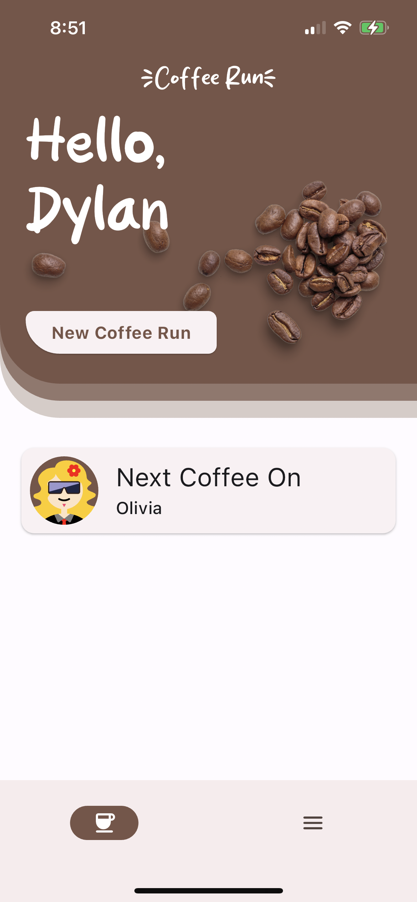

# Coffee Run

<div style="text-align: center;">
  
</div>

For images of the full app: [APP_IMAGES.md](/APP_IMAGES.md)

## Overview

Coffee Run is a simple mobile application that helps keep track of coworkers or individuals who go on coffee runs frequently. More specifically Coffee Run is aimed to help keep track of who's turn it is to pay for coffee within a group. To calculate who pays next, it chooses the member who is in the most debt to the group.

For **best** experience use this application on a **mobile device.** I recommend downloading it as a PWA for a more native experience ([Instructions](https://mobilesyrup.com/2020/05/24/how-install-progressive-web-app-pwa-android-ios-pc-mac/)).

**Demo: ** [https://coffeerun.sharpdylan.com/](https://coffeerun.sharpdylan.com/)

## Features

- Cross-platform building for iOS, Android, and Web
- Web PWA (Progressive Web App)
- Onboarding new user flow
- Create new coffee orders
- View who's next to pay
- View past coffee orders
- Start a new order from a previous order
- Input validation
- View "brewmates" (coffee roommates or rather members) sorted by who pays next
- Fun random avatars
- Realtime syncing between members

Work in progress features:

- Integrating an ML model for parsing receipts into structured data to improve UX during order entry. See ([python/receipt_model.ipynb](/python/receipt_model.ipynb))

## Assumptions

- Mobile-first user experience
- Users go out for coffee vs ordering for delivery (see roadmap for ordering feature set)

## Technical Details

I chose to build this project in Flutter because of the underlying assumption that the core user would prefer a mobile application. Flutter is perfect for this as it can build multiple platforms from a single code base. The project utilizes Firebase as a backend, utilizing Firestore and Firebase Authentication.

### Folder Structure Overview

- `coffee_run` - Root of Flutter Project
  - `lib` - Core dart files
    - `models` - Firestore models with serialization and deserialization logic provided by `json_serializable`
    - `pages` - Core pages of the application. Includes full-screen dialogs
    - `view_models` - View models for the application
  - `test` - Contains small unit test coverage
  - `firebase_emulators` - Firebase emulator data checkpoint. Can import from here when starting emulators
- `python`
  - `receipt_model.ipynb` - Python notebook showing a simple example of how we could integrate machine learning into the backend to enhance the application experience by parsing structured data from receipt images
  - `base_implementation.ipynb` - Base implementation of the "Highest-Debt" payment picker.

### Models

`json_serializable` is used to help construct `toJson()` and `fromJson()` methods for our firestore models. This code is generated into a .g.dart file. To generate these files run `dart run build_runner build`

### Firebase

Firebase is used to provide easily scalable backends for Authentication, Database, and Hosting.

## Developer Setup

### Prerequisites

**NOTE:** Please reach out to me personally before attempting to run. You will need api keys filled out in `firebase_options.dart` along with secret files for iOS and android to run. Minor additional work is needed if you wish to set up your own firebase project.

#### Required

- Flutter & Dart Installed (https://docs.flutter.dev/get-started/install)
- Code Editor (Android Studio or Visual Studio Code)
- Java installed (for firestore local emulators)
- Git
- Firebase CLI (`npm install -g firebase-tools`)

#### Optional

- Android build tools (required for building android app)
- MacOS w/ Xcode (required for building iOS app)
- Chrome (required for doing web development )

### Steps to run in debug locally

1. Clone this repository

   ```
   git clone <repo>
   ```

2. Navigate to flutter project

   ```
   cd coffee-run
   ```

3. Start flutter emulators

   ```
   firebase emulators:start --import firebase_emulators --only firestore,auth
   ```

4. In a new terminal navigate back to the flutter root and start flutter web in debug

   ```
   flutter run -d chrome
   ```

## Potential Feature Roadmap

In no specific order.

- Edit & delete past orders
- Receipt parsing into structured output to improve order entry.
- Ordering Feature Set - Allow members to submit orders to the individual paying and/or integrate DoorDash and other delivery options.
- Improve Security
  - Lockdown firestore security rules
  - Implement additional account providers via Firebase Auth
- Improve UI/UX
  - Improve design system and branding
  - Implement more micro interactions
- Coffee Stats
  - Display coffee statistics on home page
    - i.e. drink diversity
- Groups
  - Finish the group feature set by allowing users to create, join, and share individual groups instead of one for the whole app
- Account Preferences
  - Edit name, avatar, email, password, etc.
- Settle up debt
  - Allow users to pay back debt
  - Optionally: simplify debt payback (i.e. https://medium.com/@mithunmk93/algorithm-behind-splitwises-debt-simplification-feature-8ac485e97688)
- Expand testing coverage of the application
